# Mesh Smoothing Lecture Lab

**An interactive, visual playground for learning how mesh smoothing works — change a control, watch the geometry update, and read the math and metrics beside it.**

This project was developed as part of the Computer Graphics course taught by **Professor Roi Poranne**. It is a student learning tool built around one topic in depth: **mesh smoothing**. (The course and instructor are credited for context; this does not imply that Professor Poranne personally developed, reviewed, or endorsed the implementation.)

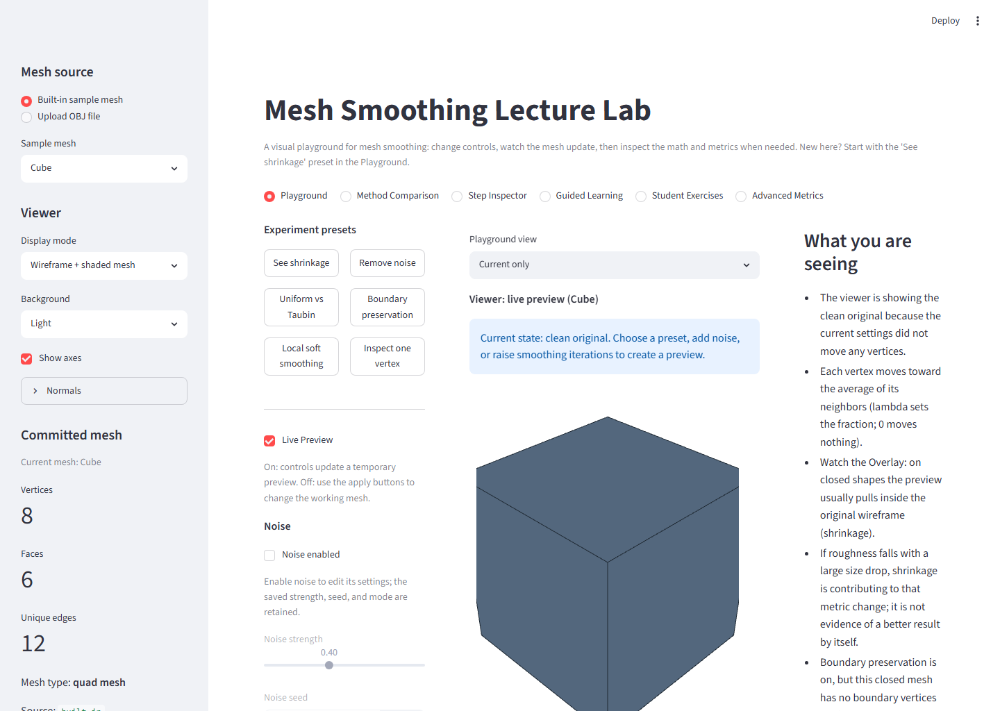

---

## Table of contents

1. [What it is](#1-what-it-is)
2. [Why this project exists](#2-why-this-project-exists)
3. [Learning goals](#3-learning-goals)
4. [The main app experience](#4-the-main-app-experience)
5. [Feature overview](#5-feature-overview)
6. [Mesh sources](#6-mesh-sources)
7. [Visualization modes](#7-visualization-modes)
8. [Controlled noise experiment](#8-controlled-noise-experiment)
9. [Smoothing methods](#9-smoothing-methods)
10. [Method support matrix](#10-method-support-matrix)
11. [Live Preview and the state model](#11-live-preview-and-the-state-model)
12. [Before / after comparison](#12-before--after-comparison)
13. [Metrics](#13-metrics)
14. [Method Comparison](#14-method-comparison)
15. [Step Inspector](#15-step-inspector)
16. [Guided Learning](#16-guided-learning)
17. [Student Exercises](#17-student-exercises)
18. [Advanced Metrics and history](#18-advanced-metrics-and-history)
19. [Suggested learning paths](#19-suggested-learning-paths)
20. [Suggested professor / demo flow](#20-suggested-professor--demo-flow)
21. [Installation](#21-installation)
22. [Running the app](#22-running-the-app)
23. [Project structure](#23-project-structure)
24. [Technical implementation](#24-technical-implementation)
25. [Testing and QA](#25-testing-and-qa)
26. [Limitations](#26-limitations)
27. [Future improvements](#27-future-improvements)
28. [Course attribution](#28-course-attribution)
29. [Author](#29-author)

---

## 1. What it is

**Mesh Smoothing Lecture Lab** is an interactive Streamlit application for exploring how mesh smoothing changes a 3D surface. Students pick a mesh, apply a smoothing method (or a one-click preset), and immediately see the result in a live 3D viewer, next to a plain-language explanation and a small set of honest metrics. A step inspector shows the exact per-vertex arithmetic behind a single smoothing step.

The goal is to connect three things that are usually presented separately in a lecture: **the control you change**, **the geometry that moves**, and **the formula and numbers that explain why**.

## 2. Why this project exists

Mesh smoothing is easy to state as a formula and hard to *feel* from slides alone. A student can memorize "move each vertex toward the average of its neighbors" without ever seeing why that shrinks a sphere, why a grid border collapses inward, or why Taubin smoothing needs two passes.

This lab addresses that by making the loop tight and visual:

- change a parameter and the mesh updates instantly (live preview);
- a short "What you are seeing" panel explains the current state in beginner terms;
- metrics quantify what changed, with their limitations stated openly;
- everything stays focused on one subject — mesh smoothing — instead of a broad graphics toolkit.

## 3. Learning goals

After using the lab a student should understand:

- **polygonal meshes** — vertices, edges, and faces, and that smoothing moves vertices without changing connectivity;
- **connectivity and one-ring neighbors** — the set of vertices directly connected to a vertex;
- **face and vertex normals** — including area-weighted vertex normals;
- **neighbor-average (Laplacian) smoothing** and the role of `lambda` and iterations;
- **shrinkage** — why repeated averaging pulls closed shapes inward;
- **noise and noise removal** — adding controlled roughness and smoothing it away;
- **boundary behavior** — how open edges are detected and optionally pinned;
- **Uniform Laplacian, Taubin, and Cotangent-weighted smoothing**, and their trade-offs;
- **local / soft smoothing** — restricting an edit to a region via graph distance;
- **how to read metrics honestly** — that lower roughness alone is not "better";
- **the per-vertex computation** behind a single smoothing step.

## 4. The main app experience

The default **Playground** is the heart of the app. A typical loop:

1. **Choose a mesh** in the sidebar (or upload an OBJ).
2. **Pick a preset** (e.g. *See shrinkage*) or set controls manually.
3. **Change a control** — smoothing method, iterations, `lambda`, noise, boundary preservation.
4. **Watch the live preview** update in the 3D viewer.
5. **Read the explanation** panel and the metric strip beneath the viewer.
6. **Commit** the preview to make it the working mesh, or **Reset** to return to the clean original.

Everything above happens without leaving the page, so the effect of each control is immediate and reversible.

## 5. Feature overview

| Feature | What it demonstrates | Where to find it |
| --- | --- | --- |
| Experiment presets | One-click, correct setups for each concept | Playground → *Experiment presets* |
| Live preview + Commit/Reset | Non-destructive experimentation and a clean state model | Playground |
| Mesh sources + OBJ upload | Different topologies and safe file handling | Sidebar → *Mesh source* |
| Visualization modes + normals | Solid / wireframe / points, face & vertex normals | Sidebar → *Viewer* |
| Controlled noise | Reproducible synthetic roughness to smooth away | Playground → *Noise* |
| Uniform Laplacian | Neighbor-average smoothing and shrinkage | Playground → *Smoothing* |
| Taubin | Two-pass smoothing that limits shrinkage (with a stability check) | Playground → *Smoothing* |
| Cotangent-weighted | Geometry-aware, triangle-only smoothing | Playground → *Smoothing* |
| Local / soft smoothing | Graph-distance soft selection with falloff | Playground → *Smoothing mode* |
| Boundary preservation | Pinning detected open-edge vertices | Playground → *Preserve boundary vertices* |
| Metric strip + cards | Roughness, size, displacement, topology, boundary motion | Playground (under the viewer) |
| Method Comparison | All methods on one shared, explicit input | Section: *Method Comparison* |
| Step Inspector | Per-vertex arithmetic of one smoothing step | Section: *Step Inspector* |
| Guided Learning | Concept-to-experiment walkthrough | Section: *Guided Learning* |
| Student Exercises | Seven self-guided lab activities | Section: *Student Exercises* |
| Advanced Metrics + summary | Full tables, history, and a Markdown download | Section: *Advanced Metrics* |

## 6. Mesh sources

Built-in meshes and an OBJ upload are available in the sidebar under **Mesh source**:

- **Cube** — 8 vertices, 6 quad faces (a quad mesh).
- **Plane/grid** — a flat 5×5 grid; the only built-in mesh with an open **boundary**, ideal for boundary-preservation demos.
- **Low-poly sphere** — 42 vertices, 80 **triangle** faces; a closed triangle mesh (works with every method, including Cotangent).
- **Cylinder** — quad walls plus polygon caps (a **mixed** mesh).
- **OBJ upload** — load your own mesh. Files are size-limited and parsed safely; some OBJ files are triangulated by the loader on import.
- **Invalid upload fallback** — a malformed or empty OBJ shows a clear error and the app falls back to the default Cube instead of crashing.

Switching the mesh source resets the experiment controls to a neutral state (presets carry their own settings), so a stale operation never silently transforms a new mesh.

## 7. Visualization modes

The **Viewer** sidebar controls how the mesh is drawn (in the *Current only* Playground view):

- **Solid shaded mesh** — faces and surface shape.
- **Wireframe** — edges only.
- **Points/vertices** — vertices only.
- **Wireframe + shaded mesh** — shaded faces with edges overlaid (default).
- **Show axes** and a light/dark **Background**.
- **Normals** (expander) — toggle **face normals** and **vertex normals**, adjust **normal length**, and choose the vertex-normal weighting (average vs area-weighted).

Controls that do not apply in a given view are **disabled with an explanation** rather than silently ignored (for example, normal overlays draw only in the *Current only* view).

| Display modes (Wireframe) | Face + vertex normals |
| --- | --- |
| 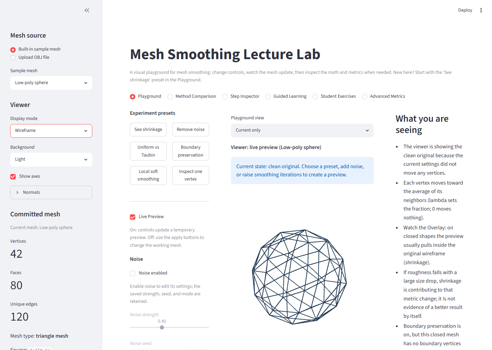 | 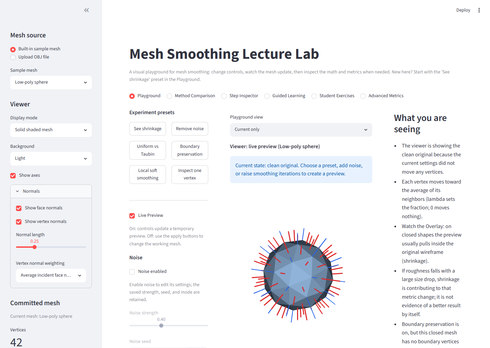 |

## 8. Controlled noise experiment

To practice **noise removal**, the lab can add synthetic, reproducible roughness to a mesh:

- **Why:** a clean built-in mesh has little to smooth; adding controlled noise creates a clean → noisy → smoothed story you can measure.
- **Seed reproducibility:** the same input mesh, mode, and seed always produce the same noise.
- **Strength:** noise magnitude is `strength × median edge length`, capped at half an edge so it cannot explode the mesh.
- **Displacement mode:** *Along vertex normals* (area-weighted; degenerate normals fall back to random 3D) or *Random 3D displacement*.
- **Learning flow:** the explanation panel prints the roughness sequence *start → noisy → smoothed*, so you can confirm smoothing brought the value back down.

Noise settings are disabled until **Noise enabled** is checked, and a zero-strength noise stage is never recorded as work.

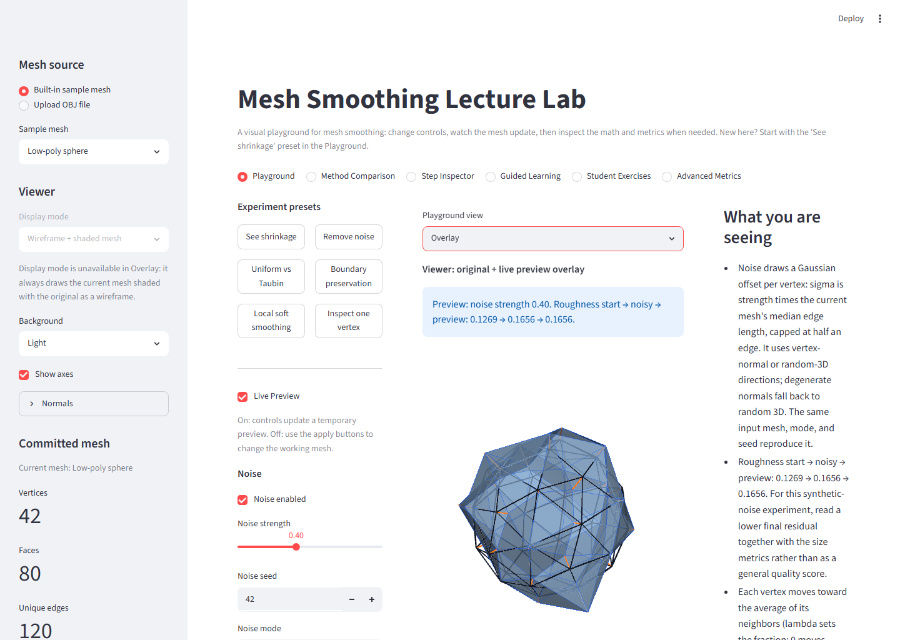

*Overlay: the black wireframe is the clean original; the blue shaded surface is the noisy preview; orange lines are sampled vertex displacements.*

## 9. Smoothing methods

All methods reuse the mesh connectivity unchanged — only vertex positions move — so vertex/face/edge counts are always preserved. Full formulas and implementation assumptions are in [docs/METHODS.md](docs/METHODS.md).

### Uniform Laplacian smoothing

Each movable vertex moves toward the average of its one-ring neighbors:

```
v_new = v + lambda * (mean(neighbors) - v)
```

- **`lambda` (0–1)** sets the fraction of the move each iteration; `lambda = 0` moves nothing.
- **Iterations** repeat the step; every vertex reads its neighbors' *old* positions (a synchronous update).
- **Shrinkage trade-off:** repeated averaging pulls closed shapes inward — the classic problem Taubin addresses.
- **Supported meshes:** all.

| Smoothed sphere (Current only) | Shrinkage (Overlay) |
| --- | --- |
| 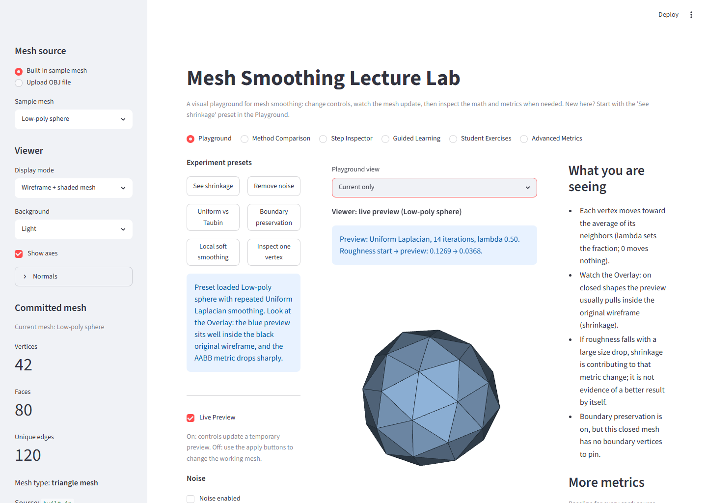 | 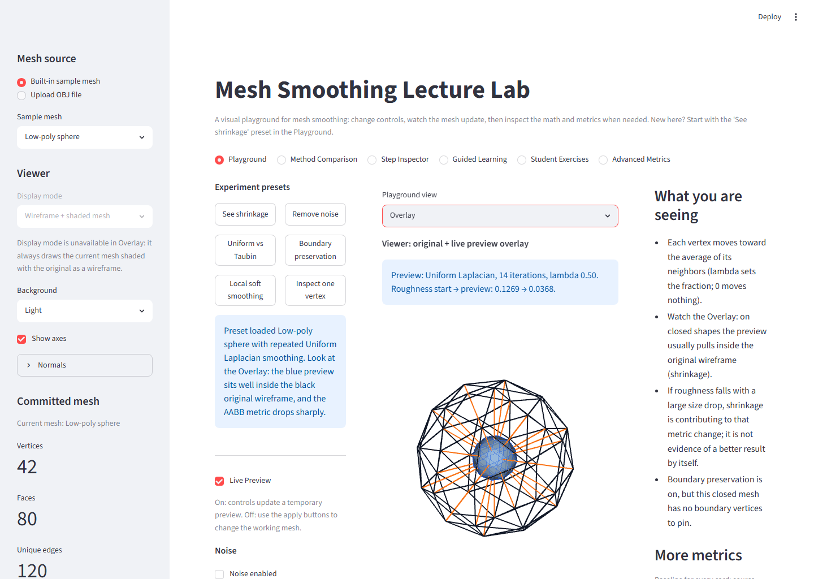 |

### Taubin smoothing

Each iteration applies a positive smoothing pass (`lambda`) followed by a negative correction pass (`mu < 0`):

```
v = v + lambda * (mean(neighbors) - v)     # positive smoothing
v = v + mu     * (mean(neighbors) - v)     # negative correction, mu < 0
```

- **Goal:** relax roughness while limiting the shrinkage that plain Laplacian smoothing causes. On the low-poly sphere, 10 Uniform steps shrink the bounding-box diagonal by roughly 60%, while the stable Taubin pair changes it by only a few percent.
- **Parameter safety:** the app computes the per-iteration transfer-function gain `f(w) = (1 − lambda·w)(1 − mu·w)` over sampled frequencies and **warns when a pair is unstable**. The condition `lambda < |mu|` gives a positive pass-band but is **not sufficient** by itself — the recommended pair `lambda = 0.5, mu = -0.53` passes the check; a pair like `0.2 / -0.53` has a positive pass-band yet is correctly flagged unstable.
- **Educational note:** unstable pairs remain reachable on purpose (for exploration) but always produce a computed warning rather than silent failure.
- **Supported meshes:** all.

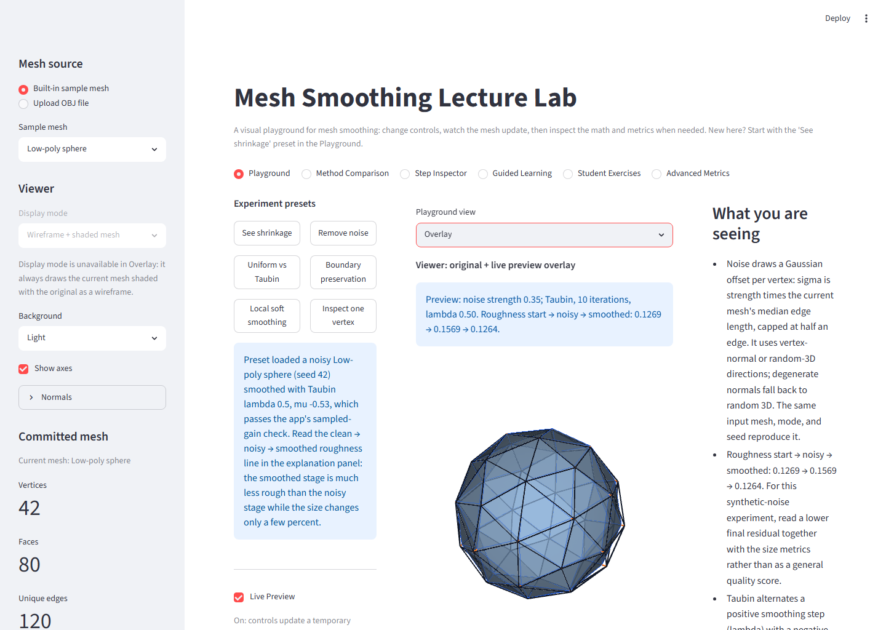

### Cotangent-weighted smoothing

Neighbors are weighted using the triangle angles opposite each edge, `w_ij = ½(cot α + cot β)`, so the target respects triangle shape rather than treating all neighbors equally.

- **Triangle-only:** this method is defined only for triangle meshes; on other meshes the lab shows a clear "unsupported" warning and leaves the geometry and history unchanged.
- **Documented teaching simplifications:** weights are computed once from the *starting* geometry and reused across iterations; aggregate negative weights (from obtuse triangles) are clamped to zero; the update normalizes by the positive weight sum instead of using a vertex-area mass term. It is a stable classroom smoother, **not** a full Laplace–Beltrami discretization.
- **Supported meshes:** Low-poly sphere, and triangle OBJ uploads (e.g. `pyramid.obj`).

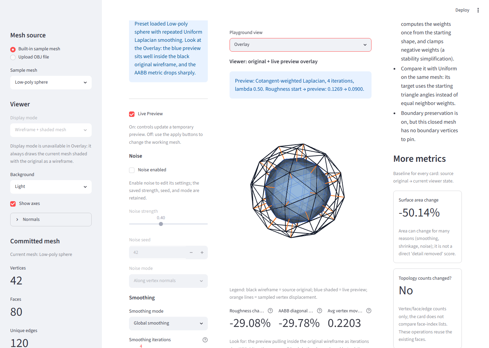

### Local / soft smoothing

Uniform smoothing scaled by a soft-selection weight based on **graph distance** (edge hops) from a chosen center vertex:

```
v_new = v + strength * local_weight(v) * (mean(neighbors) - v)
```

- **Center vertex** — the middle of the soft brush (chosen by index).
- **Radius** — how many edge hops the brush reaches.
- **Falloff** — *linear* or *smoothstep*. Because graph distances are integers, the two curves are identical at radius 1–2 and first differ at radius 3, so the selector is locked below radius 3 with an explanation.
- **Affected region** — the center is red; nonzero-weight vertices are orange; vertices exactly at the radius have weight 0 and are neither moved nor highlighted.
- **Connection to soft selection** — this mirrors the "soft selection / proportional edit" idea from modeling tools, driven here by mesh connectivity.

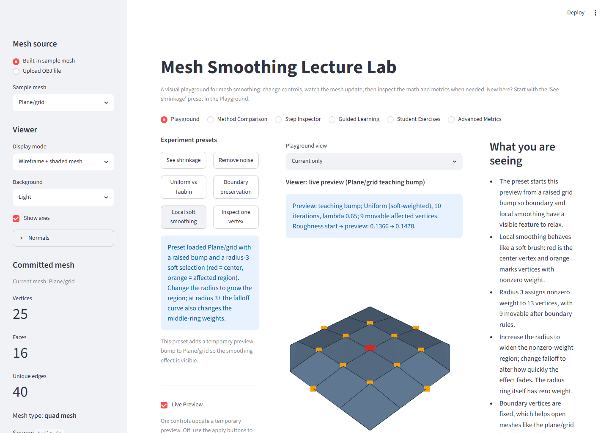

## 10. Method support matrix

Behavior reflects the current implementation (verified against the code):

| Mesh | Type | Uniform | Taubin | Cotangent | Local / soft | Notes |
| --- | --- | :---: | :---: | :---: | :---: | --- |
| Cube | quad | ✅ | ✅ | ❌ | ✅ | Closed; no boundary to pin |
| Plane/grid | quad | ✅ | ✅ | ❌ | ✅ | Open boundary — best for pinning demos |
| Low-poly sphere | triangle | ✅ | ✅ | ✅ | ✅ | Works with every method |
| Cylinder | mixed (quad + polygon caps) | ✅ | ✅ | ❌ | ✅ | Cotangent needs triangles only |
| `pyramid.obj` | triangle (after load) | ✅ | ✅ | ✅ | ✅ | Quad base loads as triangles |

Cotangent smoothing requires a **triangle-only** mesh; unsupported meshes show a warning and never produce fake cotangent output.

## 11. Live Preview and the state model

The lab keeps **four named states** separate so experiments cannot silently overwrite each other:

- **Source original** — the untouched mesh from the sidebar source.
- **Committed working mesh** — the result of committed actions; the Step Inspector and Advanced Metrics read it, and it is Method Comparison's default input.
- **Noisy preview stage** — when a live preview includes noise, the noisy mesh *before* smoothing (usable as a comparison input).
- **Live preview** — the temporary result of the current controls.

How it behaves:

- **Live Preview on (default):** changing a control recomputes the preview from the committed working mesh **without mutating it**. A stage counts as "changed" only when vertices actually move, so zero-lambda / zero-strength actions cannot be committed or recorded.
- **Commit preview as current mesh:** promotes the preview to the working mesh, records exactly what happened in the history, and resets the one-shot noise/iteration controls — so the same operation is not immediately re-applied.
- **Reset experiment:** restores the clean original and neutral controls at any time.
- **Live Preview off:** the **Add noise to current mesh** and **Apply smoothing** buttons mutate the working mesh directly, and are disabled (with an explanation) when their settings would do nothing.

## 12. Before / after comparison

The **Playground view** selector offers four ways to see the change:

- **Current only** — just the current/preview mesh (enables display modes and normals).
- **Overlay** — the current mesh shaded, drawn inside the source original as a wireframe. The clearest before/after view for shrinkage.
- **Side-by-side** — original and current rendered in **one shared scene and camera**, so a real size difference shows as a real size difference (no independent auto-fit hiding shrinkage).
- **Original only** — the untouched source, with a heading and legend that make clear the preview is not shown.

What to look for: in Overlay on a closed mesh, the preview usually pulls *inside* the original wireframe (shrinkage); the metric strip confirms it with the roughness and AABB-diagonal changes.

## 13. Metrics

Metrics appear in a sticky strip under the viewer, in metric cards, and in full tables under Advanced Metrics. Each names its baseline. They are intentionally honest about what they do and do not mean:

- **Roughness (mean neighbor distance)** — the mean of `‖v − mean(neighbors)‖` over vertices with neighbors, in mesh length units. **Scale-dependent:** uniformly shrinking a mesh also lowers it, so it must be read together with the size metrics. It is *not* an absolute "quality" score, and lower roughness with a large size drop indicates collapse, not better smoothing.
- **Average / maximum vertex displacement** — mean and largest per-vertex distance moved from the source original (requires matching vertex indices), in length units.
- **AABB diagonal change** — change in the axis-aligned bounding-box diagonal; an orientation-sensitive size proxy, not a full shape measure.
- **Surface area change** — fan-triangulated area, in squared units; can move for many reasons and is not a direct "detail removed" score.
- **Volume change** — shown only when Trimesh reports a watertight, winding-consistent, nonzero-volume mesh; it is an aggregate signed-volume magnitude, so oppositely oriented disconnected components can cancel. Treat it as an observation, not a strict validity check.
- **Boundary moved?** — on open meshes, whether any detected boundary vertex moved more than a tiny tolerance.
- **Topology counts changed?** — compares vertex/face/edge *counts* only; these operations reuse the existing faces, so this is always "No".

## 14. Method Comparison

Runs Uniform, Taubin, and Cotangent on **one explicitly chosen input baseline** and reports literal observations.

- **Identical input:** you pick the baseline — committed working mesh, source original, noisy preview stage, or current live preview — and every method starts from that exact mesh (shown with its vertex count and roughness).
- **Non-mutating:** running a comparison never changes your working or original mesh.
- **Supported / unsupported:** a method that cannot run on the chosen mesh (e.g. Cotangent on a quad) is reported as unsupported rather than faked.
- **Interpretation:** the observations name the exact metric (AABB-diagonal change, roughness reduction) for *this* input; they do not crown a universal "best" method. Note that one Taubin iteration performs two passes, so equal iteration counts are the same input, not equal work.
- **Staleness:** results are cleared when the working mesh is committed/changed, and a stored comparison is flagged if a live-preview baseline drifts.

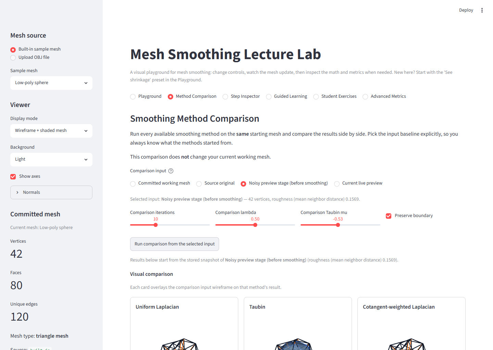

## 15. Step Inspector

Shows the exact computation for **one vertex** in a single smoothing step.

- **Selected vertex** (by index), its **neighbors**, and **valence** (neighbor count).
- **Target position** — the neighbor average (Uniform) or the cotangent-weighted target, with the per-neighbor weights.
- **Displacement** and **predicted position** after applying `lambda`/strength.
- **Boundary pinning** — a dedicated checkbox models the boundary rule; a pinned boundary vertex correctly predicts zero movement, matching what the smoother actually does.
- **Non-mutating** — inspecting never changes the mesh, and the vertex index stays valid after switching mesh source.

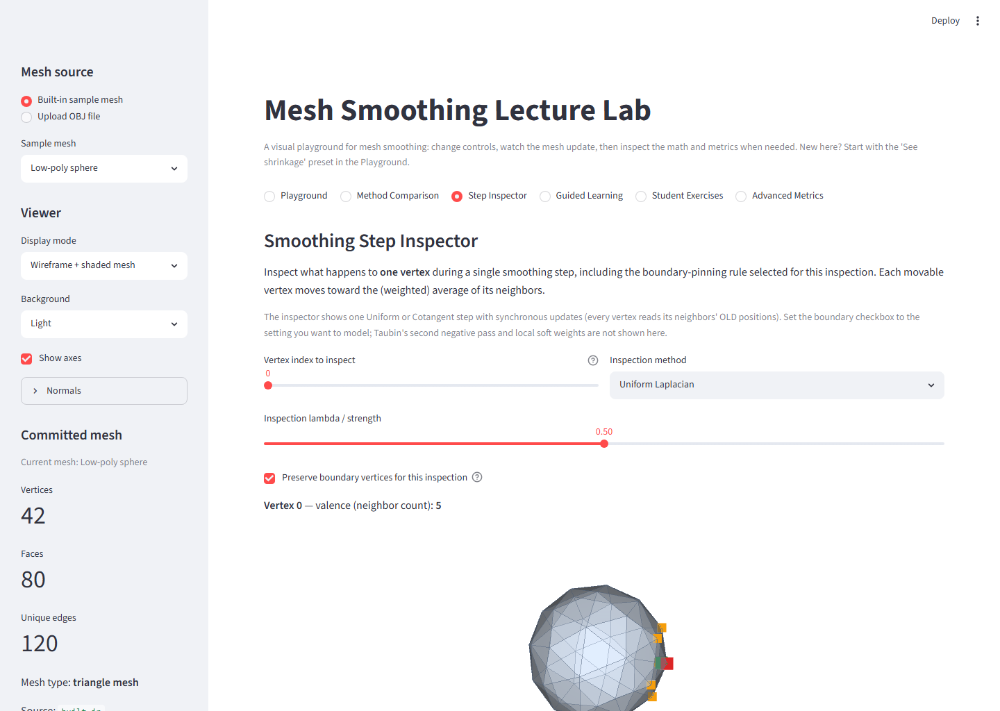

## 16. Guided Learning

A concept-to-experiment path: a short "how to use this lab" guide, an eight-step walkthrough (polygonal mesh → connectivity → normals → smoothing → shrinkage → boundaries → local → compare), and a key-terms reference. Each step pairs a concept with the exact control to try and what to expect. Guided Learning also separates **lecture-core ideas** from **project extensions** so students know what is standard material and what is added for this lab.

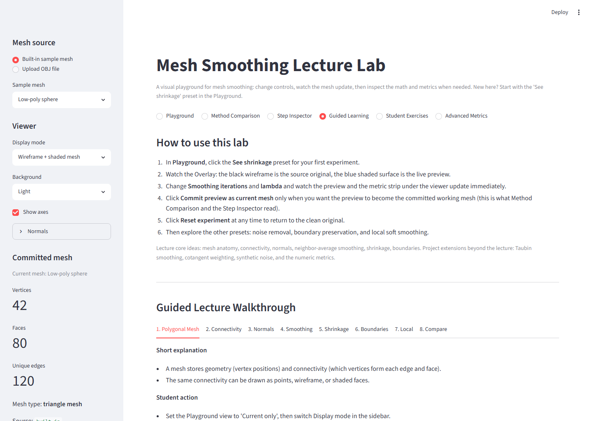

## 17. Student Exercises

Seven short, self-guided activities that mirror [docs/STUDENT_GUIDE.md](docs/STUDENT_GUIDE.md). Each gives a goal, exact steps, the expected observation, and the reason:

1. **Topology counts stay fixed** — smoothing changes geometry, not connectivity.
2. **Shrinkage** — why uniform smoothing shrinks a closed mesh.
3. **Boundary preservation** — how open boundaries behave, pinned vs free.
4. **Noise removal** — reduce roughness from synthetic noise with Taubin.
5. **Method comparison** — compare methods fairly on one shared input.
6. **Local soft smoothing** — how radius and falloff control the affected region.
7. **Step inspector** — connect the formula (and the boundary rule) to one vertex.

Students can run them top-to-bottom as a lab or jump to the one matching their question.

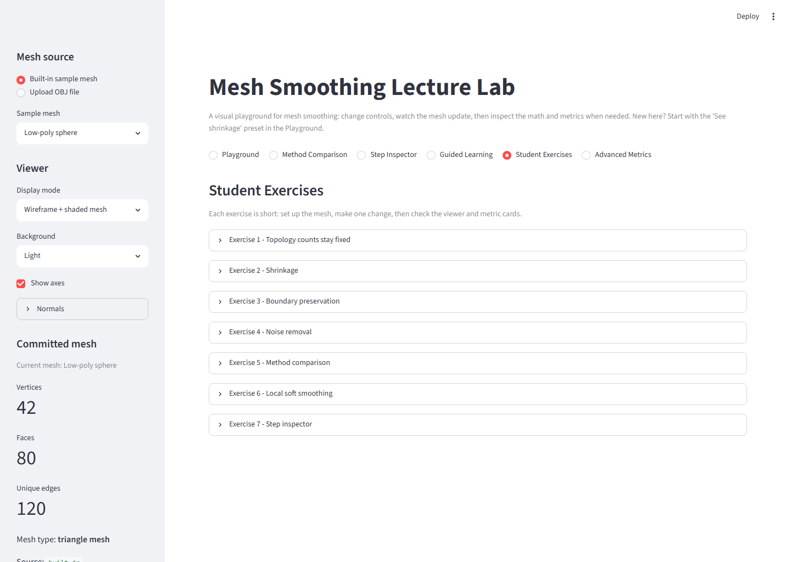

## 18. Advanced Metrics and history

The **Advanced Metrics** section holds the full picture of the committed experiment:

- **Observation tables** — topology counts, displacement, and size metrics vs the source original.
- **Roughness breakdown** — mean / max / RMS neighbor distance.
- **Committed Action History** — one row per committed action (method, iterations, `lambda`/`mu`, noise settings, boundary flag, roughness before/after, size change).
- **Learning Summary** — a snapshot of the committed state, downloadable as a **Markdown** file generated strictly from committed history (never from uncommitted widgets), so a saved report always describes the geometry it actually produced.

| Advanced metrics & history | Learning summary (downloadable) |
| --- | --- |
| 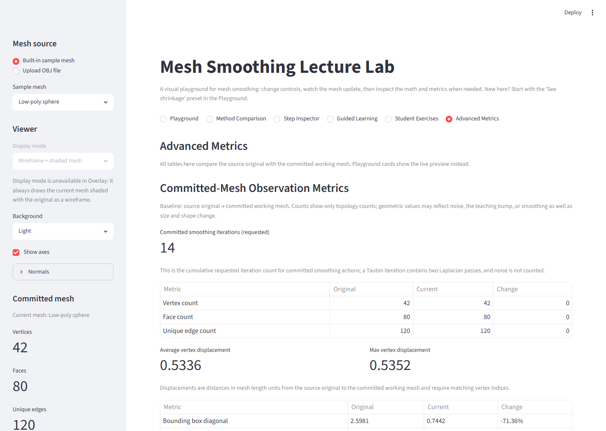 | 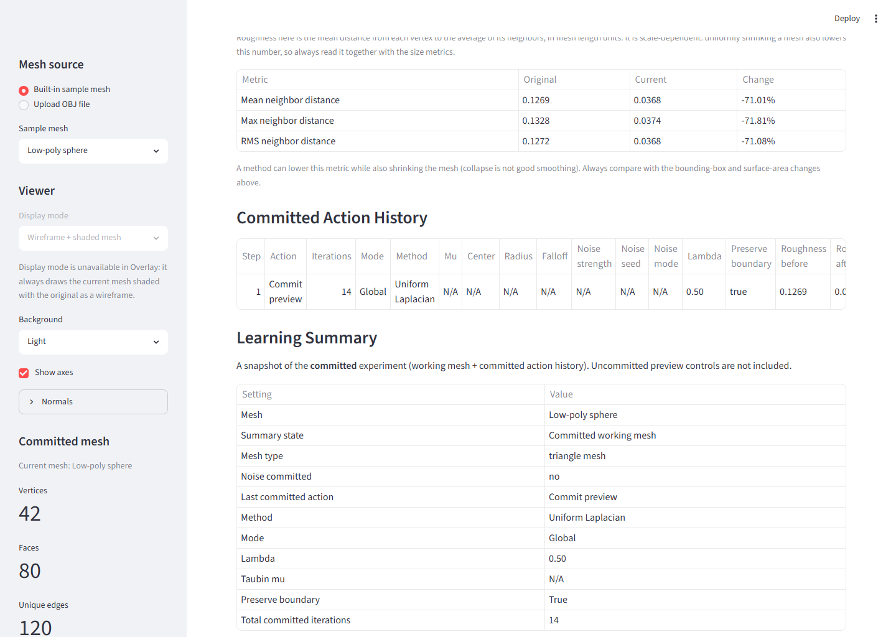 |

## 19. Suggested learning paths

### Beginner — 5-minute introduction

1. **Playground** → click **See shrinkage**.
2. Set **Playground view** to **Overlay**; watch the blue preview sit inside the black original wireframe.
3. Read the metric strip: roughness change and AABB-diagonal change are both strongly negative.
4. Click **Reset experiment**.

### Student — 20-minute guided lab

1. Open **Guided Learning** and skim the eight-step walkthrough.
2. In the **Playground**, work through **Student Exercises** 1–4 (topology, shrinkage, boundary preservation, noise removal), committing where the exercise says to.
3. Click **Uniform vs Taubin**, open **Method Comparison**, set the input to **Noisy preview stage (before smoothing)**, and run it.
4. Open **Step Inspector** (via **Inspect one vertex**) and compare a corner vertex with an interior vertex.

### Advanced — method and metric investigation

1. On the Low-poly sphere, compare **Uniform**, **Taubin**, and **Cotangent** at matched iterations in **Method Comparison**; note the AABB-diagonal and roughness differences.
2. In the **Playground**, drive Taubin toward an unstable pair (e.g. `lambda 0.2`) and read the sampled-gain warning.
3. Use **Local / soft smoothing** at radius 1 vs radius 3, switching falloff at radius 3, and read the per-distance weight table.
4. Commit a sequence of actions, then open **Advanced Metrics** and download the Markdown summary.

## 20. Suggested professor / demo flow

A tight 2–3 minute walkthrough (full script in [docs/DEMO_SCRIPT.md](docs/DEMO_SCRIPT.md)):

1. **Playground → See shrinkage** — Overlay shows the preview shrinking inside the original; the metric strip confirms it. *"Uniform averaging smooths, but on closed shapes it also pulls inward."*
2. **Reset experiment → Remove noise** — read the *start → noisy → smoothed* roughness line; the smoothed value drops well below the noisy one with only a small size change.
3. **Uniform vs Taubin → Method Comparison** — run from the noisy preview stage; observations name the exact metric instead of a "best" method.
4. **Boundary preservation** — toggle **Preserve boundary vertices**: the grid border slides inward when off, stays pinned when on.
5. **Step Inspector** — corner vertex (pinned, no motion) vs an interior vertex (moves toward its neighbor average).

## 21. Installation

Requires **Python 3.11+** (developed and tested on Python 3.13).

```bash
python -m venv .venv
.venv\Scripts\activate          # Windows
# source .venv/bin/activate     # macOS / Linux
pip install -r requirements.txt
```

Dependencies: `streamlit`, `numpy`, `trimesh`, `pyvista`, `panel` (see [requirements.txt](requirements.txt)).

## 22. Running the app

```bash
python -m streamlit run app.py
```

Streamlit prints a local URL (default `http://localhost:8501`); open it in a browser. Running via `python -m streamlit` avoids PATH issues with the bare `streamlit` launcher on some Windows setups.

## 23. Project structure

```
Interactive Mesh Processing Visualizer/
├── app.py                     # Streamlit UI: layout, controls, state, viewer, sections
├── requirements.txt           # Runtime dependencies
├── README.md                  # This document
├── .gitignore
├── src/
│   ├── mesh_core.py           # MeshData model, OBJ loading, edge/topology helpers
│   ├── sample_meshes.py       # Built-in cube, plane/grid, sphere, cylinder
│   ├── mesh_ops.py            # Smoothing methods, noise, roughness, inspectors
│   ├── mesh_metrics.py        # Size/area/volume/displacement metrics
│   └── visualization.py       # PyVista plotters + Panel→HTML embedding
├── examples/
│   └── pyramid.obj            # Sample triangle OBJ for upload
├── tests/                     # Automated test suite (pytest)
│   ├── test_mesh_ops.py       # Smoothing/noise/roughness algorithm tests
│   ├── test_presets_and_metrics.py
│   ├── test_app_state.py      # Streamlit AppTest state-transition tests
│   └── test_release_qa.py     # End-to-end control/behavior regressions
├── docs/
│   ├── METHODS.md             # Formulas and implementation assumptions
│   ├── STUDENT_GUIDE.md       # Step-by-step exercises
│   ├── DEMO_SCRIPT.md         # 2–3 minute presentation flow
│   ├── PROJECT_STRUCTURE.md   # Architecture and file responsibilities
│   ├── CLEANUP_REPORT.md      # Record of the submission cleanup
│   └── screenshots/           # README images (01–16)
└── assets/                    # Placeholder for runtime assets
```

See [docs/PROJECT_STRUCTURE.md](docs/PROJECT_STRUCTURE.md) for module responsibilities and data flow.

## 24. Technical implementation

- **NumPy** — all vertex math (adjacency averaging, normals, displacement) is vectorized where practical.
- **Trimesh** — OBJ loading and area/volume/watertightness metrics.
- **PyVista** — builds the 3D scene (meshes, wireframes, normals, axes).
- **Panel + iframe** — each PyVista plotter is exported to a self-contained HTML/VTK.js scene (`plotter_to_html`) and embedded with `st.iframe`, so the viewer renders in the browser.
- **Streamlit** — UI, widgets, and `session_state` for the four-state model and live preview.
- **Graph adjacency** — one-ring neighbors are built from unique face edges; local regions use breadth-first graph distance.
- **Method dispatcher** — `apply_global_smoothing` routes to the selected method and returns a result object carrying a `supported` flag and note, so unsupported combinations warn instead of crashing.
- **Metrics** — computed separately from rendering, each with an explicit baseline.
- **Tests** — pure-algorithm tests plus Streamlit `AppTest` tests that drive real widgets and assert on resulting state.

## 25. Testing and QA

The project ships with an automated test suite (run from the repo root):

```bash
python -m compileall .        # syntax/compile check
python -m pytest              # full suite — 49 tests
```

Current status: **49 tests pass**. Coverage includes:

- **Algorithms** — Uniform formula correctness, boundary pinning, noise determinism, Taubin stability (recommended vs bad pairs), cotangent support/unsupported, falloff-weight behavior, and roughness scale-dependence.
- **Metrics** — volume gating for inconsistent/cancelling meshes, percent-change guards, and the denoising preset actually reducing roughness.
- **App state (Streamlit `AppTest`)** — reset without crashing, zero-effect actions not committable, noise-enable gating, commit not re-applying itself, comparison non-mutation and invalidation, download summary matching committed history, source-switch index clamping, and contextual disabling of viewer/noise controls.

The app was additionally driven end-to-end in a real browser (Playwright/Chromium) at desktop and narrow (768 px) widths with **no console or server errors**; the screenshots in this README come from that current build.

## 26. Limitations

Stated honestly so results are not over-interpreted:

- **Cotangent is triangle-only** and is a simplified teaching smoother (frozen weights, clamped negatives, no mass matrix) — not a full Laplace–Beltrami operator.
- **Imported OBJ meshes** may be triangulated by the loader on import, which can change face counts relative to the source file.
- **Volume** is trustworthy only for watertight, winding-consistent, nonzero-volume meshes; opposing disconnected components can cancel in the aggregate value.
- **Roughness is scale-dependent** — always read it with the size metrics.
- **Local regions use graph distance** (edge hops), not Euclidean distance; the radius ring itself has zero weight.
- **Vertex selection is numeric** (sliders) — there is no mouse picking in the 3D viewer.
- **Rendering is intentionally simple** and the live preview has a large-mesh safety guard, to keep the lesson focused and the app responsive; the embedded viewer re-creates its WebGL context on each change (harmless per-render warnings, no errors).

## 27. Future improvements

Focused, in keeping with the project's single-topic scope:

- direct mouse vertex picking in the 3D viewer;
- a persistent three-pane clean/noisy/smoothed visual sequence;
- more curated example meshes for upload;
- optional additional *validated* smoothing methods;
- rendering/performance refinements for larger meshes.

## 28. Course attribution

This project was developed as part of the **Computer Graphics course taught by Professor Roi Poranne**. The attribution is for academic context only and does not imply official endorsement or review of the implementation.

## 29. Author

**Basel Karkabee** — student, Computer Graphics course.
